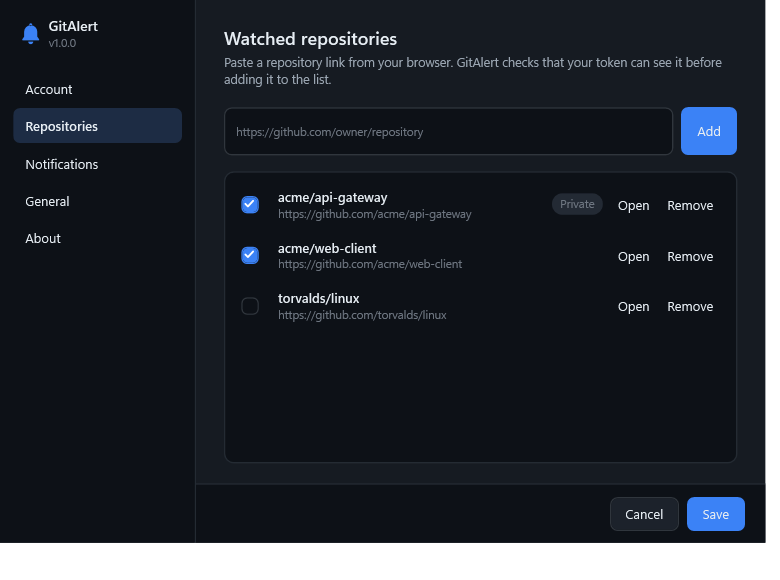

<div align="center">


# GitAlert

**A Windows tray app that watches the GitHub repositories you care about — and tells you the moment something happens.**

Pushes, pull requests, reviews, issues, comments, releases, branches and CI runs,
in one quiet panel that drops out of the notification area.

[](https://github.com/mertberkankalkan/GitAlert/actions/workflows/ci.yml)
[](https://github.com/mertberkankalkan/GitAlert/releases/latest)
[](LICENSE)
[](https://dotnet.microsoft.com/)
[](#install)

</div>

---

## Why GitAlert exists

I kept alt-tabbing to GitHub to find out whether anything had happened. Did the deploy branch move?
Did CI go red again? Did anyone actually look at that pull request? Checking a browser tab twenty
times a day is a poor substitute for being told, so I built the thing I wanted: a tray icon that
stays out of the way until there is something worth knowing.

**This is also, openly, a vibe-coding project.** It grew out of a genuine day-to-day need and it was
designed and written in conversation with an AI assistant, in one long sitting — sketching the shape,
arguing about the details, looking at the screenshots, fixing what looked wrong. The need was real,
the workflow was vibe coding, and the outcome is a tool I actually keep running. Nothing here is
generated-and-forgotten: every piece was reviewed, built, run and tested. Take it as both a useful
little app and an honest sample of what that way of working produces.

## What it does

<table>
<tr>
<td width="50%" valign="top">

**Watches what you point it at**
Paste a repository link from your browser — `https://github.com/owner/repo`, an SSH clone URL or
just `owner/repo`. GitAlert checks your token can see it before adding it.

**Covers the whole timeline**
Pushes (with the commit message and a link to the diff), pull requests opened, merged and closed,
reviews and review comments, issues and comments, releases, branches, tags, forks and stars.

**Watches CI too**
GitHub Actions runs are polled separately, because they never appear on the events timeline.
Failures are red, and you can ask to hear about failures only.

</td>
<td width="50%" valign="top">

**Your inbox, optionally**
Mentions, review requests and assignments from `/notifications`, folded into the same list.

**Quiet by design**
Mute any category you do not care about. Ignore activity you caused yourself. Choose how often it
checks, from every minute to every three hours.

**Native Windows behaviour**
Desktop notifications land in the Action Centre. The tray icon is drawn as vector art, so it stays
crisp at every DPI, adapts to a light or dark taskbar, and carries a badge when something is unread.

</td>
</tr>
</table>

<div align="center">

| Light theme | Repositories | Notifications |
|:---:|:---:|:---:|
|  |  |  |

</div>

## Install

### The installer (recommended)

Grab **`GitAlert-Setup-x.y.z-x64.exe`** from the [latest release](https://github.com/mertberkankalkan/GitAlert/releases/latest)
and run it.

It is a per-user install: no administrator prompt, nothing written outside your own profile, and a
tick box to start GitAlert when you sign in. The .NET runtime is bundled, so there is nothing else
to install.

> Windows SmartScreen will warn about an unrecognised publisher — the build is not code signed.
> Choose **More info → Run anyway**, or read the source and build it yourself.

### Portable

Prefer not to install anything? Take the `-portable.zip` from the same release, unpack it anywhere
and run `GitAlert.exe`.

### From source

```powershell
git clone https://github.com/mertberkankalkan/GitAlert.git
cd GitAlert
.\build.ps1 -Publish          # restore, build, test, publish to artifacts\publish
```

Requires the [.NET 9 SDK](https://dotnet.microsoft.com/download/dotnet/9.0). To build the installer
too, install Inno Setup 6 (`winget install JRSoftware.InnoSetup`) and run `.\build.ps1 -Installer`.

## Setting it up

1. **Create a token.** Settings → Account → *Create a token on GitHub*. The link pre-selects the
   scopes; pick an expiry you are comfortable with.

   | You want | Scope needed |
   |---|---|
   | Public repositories | *none at all* |
   | Private repositories | `repo` |
   | Mentions, review requests, assignments | `notifications` |

2. **Paste it in and hit Validate.** GitAlert tells you which account it signed in as.

3. **Add repositories.** Settings → Repositories → paste a link → *Add*.

4. **Pick an interval.** Two minutes is a sensible default; see below for why that is cheap.

The first check of a repository only records where things stand — you are not buried under weeks of
history the moment you add one. From then on, only genuinely new activity is reported.

## How it works

GitAlert is a polling client that tries hard to be a well-behaved one.

- **Conditional requests.** Every poll sends the previous `ETag`. When nothing has changed GitHub
  answers `304 Not Modified`, which costs **nothing** against the hourly rate limit. Watching five
  repositories every two minutes usually consumes a handful of calls per hour rather than hundreds.
- **`x-poll-interval` is honoured.** If GitHub asks clients to slow down, GitAlert slows down.
- **High-water marks, not guesswork.** Each repository remembers the newest event id it has seen, so
  an alert is never shown twice — not after a restart either. The CI watermark deliberately stops
  advancing at the first unfinished run, so a job that finishes late is still reported.
- **Failures are local.** A repository you lost access to does not stop the others from being
  checked; the flyout says how many could not be reached and why.

Three endpoints do the work: `/repos/{owner}/{repo}/events` for the timeline,
`/repos/{owner}/{repo}/actions/runs` for CI, and `/notifications` for your inbox.

## Your data

- The access token is encrypted with **DPAPI**, scoped to your Windows user account. The blob on
  disk is useless to another user or on another machine.
- Settings, sync state and alert history live in `%APPDATA%\GitAlert` as plain JSON you can read.
- GitAlert talks to `api.github.com` and nothing else. No telemetry, no analytics, no update pings.

Uninstalling leaves `%APPDATA%\GitAlert` in place so a reinstall picks up where you left off; delete
that folder to remove every trace.

## Project layout

```
src/GitAlert/
  Core/            Domain model: Alert, AlertKind, RepoRef parsing, relative time
  Configuration/   Settings persistence and the DPAPI-backed token store
  GitHub/          REST client, response models, event translation
  Services/        Polling engine, alert history, sync state, theming, the tray shell
  Platform/        Shell_NotifyIcon, vector icon rendering, startup registration, interop
  ViewModels/      MVVM view models (CommunityToolkit.Mvvm)
  Views/           The flyout and the settings window
  Themes/          Light and dark palettes plus the shared control styles
tests/             xUnit tests for parsing, translation, history and settings
installer/         Inno Setup script
```

A few decisions worth calling out:

- **The tray icon is native.** `Shell_NotifyIcon` is called directly rather than borrowing WinForms'
  `NotifyIcon`, which keeps the app WPF-only and leaves room for version-4 callbacks, a state badge
  and recovery when Explorer restarts.
- **One source of truth for the artwork.** The bell is vector geometry. The tray icon is rasterised
  from it at whatever size the shell asks for, and `app.ico` is generated from the very same
  geometry by the app itself (`GitAlert.exe --export-icon path.ico`), so the two can never drift.
- **One dependency.** Only `CommunityToolkit.Mvvm`. DPAPI, the notification area and window theming
  are reached through a small, auditable interop layer in `Platform/NativeMethods.cs`.

## Building and testing

```powershell
.\build.ps1                    # restore, build, run the tests
.\build.ps1 -Publish           # + self-contained win-x64 folder
.\build.ps1 -Installer -Zip    # + setup .exe and portable archive
.\build.ps1 -RegenerateIcon    # redraw app.ico from the vector artwork

dotnet test                    # tests on their own
```

CI builds and tests every push. Tagging `v1.2.3` builds the installer and publishes a release.

## Known limitations

- Windows 10 and 11, x64 only.
- Polling, not webhooks — a desktop app has nowhere for GitHub to call back to. Expect alerts within
  your chosen interval rather than instantly.
- GitHub's events timeline is served from a cache and can lag by up to about a minute, and it only
  goes back 90 days or 300 events.
- Notifications are delivered as tray balloons, which Windows renders as toasts. They carry no
  action buttons; clicking one opens the relevant page.
- The build is not code signed, so SmartScreen will warn on first run.

## Contributing

Issues and pull requests are welcome. Adding a new event type is deliberately a one-file change:
see `GitHub/EventTranslator.cs`.

## License

[MIT](LICENSE) © Mert Berkan Kalkan
