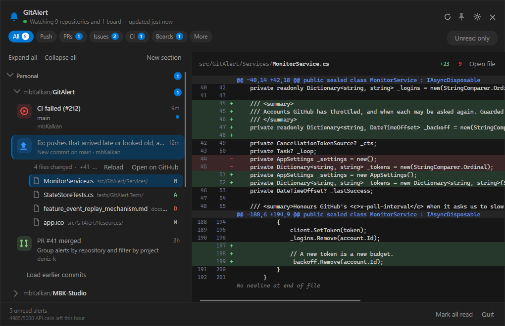
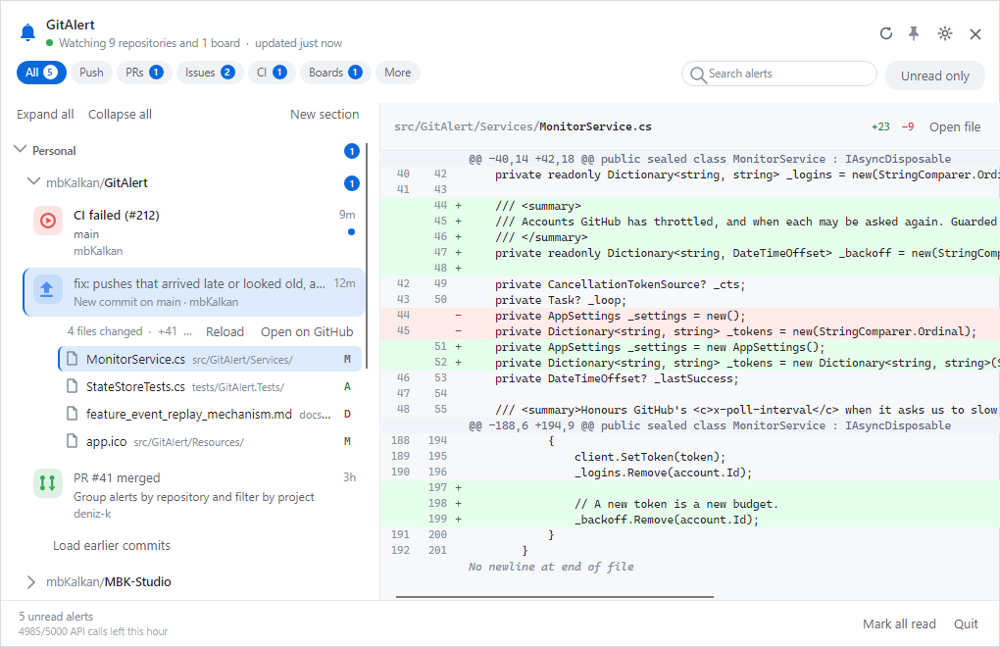
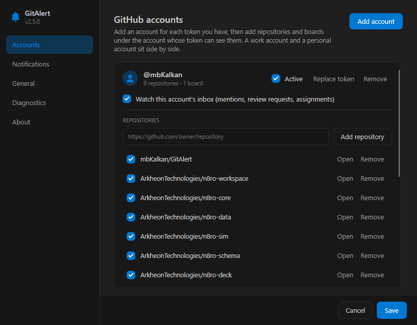
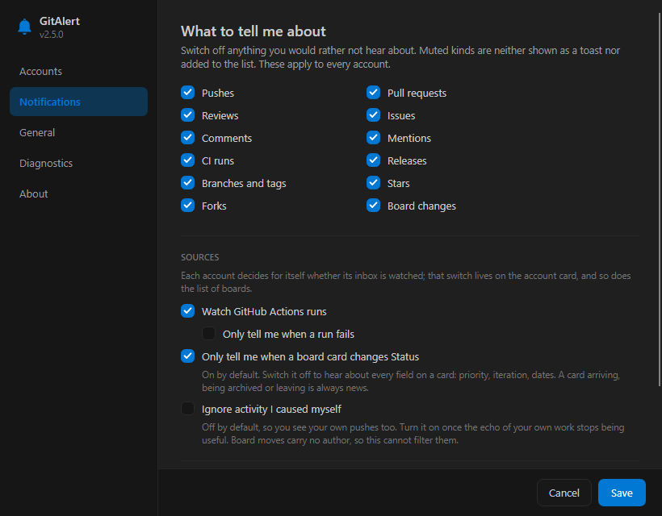

<div align="center">



# GitAlert

**A Windows tray app that watches the GitHub repositories you care about — and tells you the moment something happens.**

Pushes, pull requests, reviews, issues, comments, releases, branches and CI runs,
in one quiet panel that drops out of the notification area — and the diff, right there beside it.

[](https://github.com/mbKalkan/GitAlert/actions/workflows/ci.yml)
[](https://github.com/mbKalkan/GitAlert/releases/latest)
[](LICENSE)
[](https://dotnet.microsoft.com/)
[](#install)

</div>

---

## Why GitAlert exists

I kept alt-tabbing to GitHub to find out whether anything had happened. Did the deploy branch move?
Did CI go red again? Did anyone actually look at that pull request? Checking a browser tab twenty
times a day is a poor substitute for being told, so I built the thing I wanted: a tray icon that
stays out of the way until there is something worth knowing.

**This is also, openly, a vibe-coding project.** It grew out of a genuine day-to-day need and it was
designed and written in conversation with an AI assistant, in one long sitting — sketching the shape,
arguing about the details, looking at the screenshots, fixing what looked wrong. The need was real,
the workflow was vibe coding, and the outcome is a tool I actually keep running. Nothing here is
generated-and-forgotten: every piece was reviewed, built, run and tested. Take it as both a useful
little app and an honest sample of what that way of working produces.

## What it does

<table>
<tr>
<td width="50%" valign="top">

**One app, several GitHub accounts**
Add an account per token, then add repositories under the account whose token can see them. Work
and personal sit side by side, each with its own credentials and its own inbox.

**Pick from what your token can see**
GitAlert asks GitHub which repositories the token reaches — your own, the ones you collaborate on,
and your organisations' — and lists them to tick. Search them, sort by recent activity, name, owner
or what you already watch. Pasting a link still works: `https://github.com/owner/repo`, an SSH
clone URL or just `owner/repo`, checked against the token before it is added.

**Covers the whole timeline**
Pushes (with the commit message and a link to the diff), pull requests opened, merged and closed,
reviews and review comments, issues and comments, releases, branches, tags, forks and stars.

**Watches CI too**
GitHub Actions runs are polled separately, because they never appear on the events timeline.
Failures are red, and you can ask to hear about failures only.

**Read the diff without leaving the app**
Pick an alert and the files it touched unfold right under it — name, path and an M/A/D badge, the
way a source control view does — and the unified diff of the file you pick fills the pane beside
the list, with both line-number gutters and the colours GitHub uses. A single commit shows its own
diff, a push of several the net change across the range, a pull request its whole file list; a long
list shows its first thirty files and offers the rest. Click the alert again to fold it away.

</td>
<td width="50%" valign="top">

**Your inbox, optionally**
Mentions, review requests and assignments from `/notifications`, per account, folded into the same
list. With more than one account the cards say which identity saw each alert.

**One timeline, not a live feed and an archive**
Alerts begin the day you point GitAlert at a repository, but the commits before that are still
there. Both sit in the same list: a project's alerts, and its earlier commits fetched from GitHub
when you ask for them, ordered by when they happened. A push alert and its commit are the same
event and share an identity, so the merge collapses the duplicate instead of showing it twice.
Nothing is fetched until you ask, so the list itself costs nothing.

**A group per project, in your order, under your sections**
Each project is a collapsible group with its own count. Drag its header to wherever it belongs,
or nudge it with the arrows — so the most important repository sits at the top and stays there
across restarts. One tick on the header reads the whole project. Once the list grows, add
sections — "Work", "Open source", whatever the day is made of — and drop projects onto their
headers; a section folds and unfolds as one, has its own count and tick, remembers its fold, and
is dragged into place like a project.
"Expand all" and "Collapse all" above the list do every fold at once. One
switch turns the list back into just what needs attention: unread alerts only, and only the
projects and sections that have some.

**Quiet by design**
Mute any category you do not care about. Optionally ignore activity you caused yourself. Choose how often it
checks, from every minute to every three hours.

**A window, not a popup**
The panel opens beside the tray icon but behaves like a real window: resizable, remembered where
you left it and how you split it, and it stays put while you read. Clicking a row never scrolls
the list out from under the pointer. Dark follows VS Code's Dark Modern out of the box;
GitHub's own dark palette is one setting away. Pin it above other windows, or turn on click-away
dismissal if you prefer the popup behaviour.

**Native Windows behaviour**
Desktop notifications land in the Action Centre. The tray icon is drawn as vector art, so it stays
crisp at every DPI, adapts to a light or dark taskbar, and carries a badge when something is unread.

</td>
</tr>
</table>

<div align="center">

| Light theme | Accounts and repositories | Notifications |
|:---:|:---:|:---:|
|  |  |  |

</div>

## Install

### The installer (recommended)

Grab **`GitAlert-Setup-x.y.z-x64.exe`** from the [latest release](https://github.com/mbKalkan/GitAlert/releases/latest)
and run it.

It is a per-user install: no administrator prompt, nothing written outside your own profile, and a
tick box to start GitAlert when you sign in. The .NET runtime is bundled, so there is nothing else
to install.

> Windows SmartScreen will warn about an unrecognised publisher — the build is not code signed.
> Choose **More info → Run anyway**, or read the source and build it yourself.

### Portable

Prefer not to install anything? Take the `-portable.zip` from the same release, unpack it anywhere
and run `GitAlert.exe`.

### From source

```powershell
git clone https://github.com/mbKalkan/GitAlert.git
cd GitAlert
.\build.ps1 -Publish          # restore, build, test, publish to artifacts\publish
```

Requires the [.NET 10 SDK](https://dotnet.microsoft.com/download/dotnet/10.0). To build the installer
too, install Inno Setup 6 (`winget install JRSoftware.InnoSetup`) and run `.\build.ps1 -Installer`.

## Setting it up

1. **Create a token.** Settings → Accounts → *Add account* → *Create a token on GitHub*. The link
   pre-selects the scopes; pick an expiry you are comfortable with.

   | You want | Scope needed |
   |---|---|
   | Public repositories | *none at all* |
   | Private repositories | `repo` |
   | Mentions, review requests, assignments | `notifications` |

   The link creates a classic token. A **fine-grained token** is the tighter choice and works just
   as well: give it read access to *Metadata* and *Contents* on the repositories you watch,
   *Actions* (read) if you want CI runs, and the *Notifications* account permission for the
   inbox. Nothing GitAlert does needs write access of any kind.

2. **Paste it in and hit Add.** GitAlert verifies the token and names the account it belongs to.

3. **Add repositories under that account.** Paste a link → *Add repository*.

4. **Repeat for any other account** — a work account, an organisation-scoped token, whatever you
   have. Each keeps its own token, its own repositories and its own inbox switch.

5. **Pick an interval.** Two minutes is a sensible default; see below for why that is cheap.

A token that expires does not cost you the setup: choose *Replace token* on the account card and
the repositories stay exactly as they were.

The first check of a repository only records where things stand — you are not buried under weeks of
history the moment you add one. From then on, only genuinely new activity is reported.

## How it works

GitAlert is a polling client that tries hard to be a well-behaved one.

- **Conditional requests.** Every poll sends the previous `ETag`. When nothing has changed GitHub
  answers `304 Not Modified`, which costs **nothing** against the hourly rate limit. Watching five
  repositories every two minutes usually consumes a handful of calls per hour rather than hundreds.
- **`x-poll-interval` is honoured.** If GitHub asks clients to slow down, GitAlert slows down.
- **High-water marks, not guesswork.** Each repository remembers the newest event id it has seen, so
  an alert is never shown twice — not after a restart either. The CI watermark deliberately stops
  advancing at the first unfinished run, so a job that finishes late is still reported.
- **Failures are local.** A repository you lost access to does not stop the others from being
  checked; the flyout says how many could not be reached and why.

- **Every account is polled with its own token**, and one account failing (an expired token, a lost
  permission) never stops the others from being checked.
- **Pushes come from the commits endpoint, not the events timeline.** GitHub fills its events feed
  in lazily: for public repositories it is near real time, but for private ones it can run hours or
  days behind, and a freshly created repository may have no events at all. Reading
  `/repos/{owner}/{repo}/commits` reports a push the moment it lands. The events timeline still
  supplies everything commits cannot - pull requests, issues, comments, releases, branches, stars -
  and when it eventually catches up, the duplicate push is discarded because both sources identify
  a push by its head commit.

Four endpoints do the work: `/repos/{owner}/{repo}/commits` for pushes,
`/repos/{owner}/{repo}/events` for everything else in the timeline,
`/repos/{owner}/{repo}/actions/runs` for CI, and `/notifications` for each account's inbox.

## Your data

- Each account's access token is encrypted with **DPAPI**, scoped to your Windows user account, and
  kept in its own file under `%APPDATA%\GitAlert\tokens`. A blob on disk is useless to another user
  or on another machine, and one account's token is never used for another's repositories.
- While GitAlert runs, each token is held in memory as an ordinary .NET string so it can be sent
  with every request. That copy cannot be scrubbed, which is the same trade every desktop client
  makes; it is only ever readable by a process running as you.
- Settings, sync state and alert history live in `%APPDATA%\GitAlert` as plain JSON you can read.
- GitAlert talks to `api.github.com` and nothing else. No telemetry, no analytics, no update pings.

Uninstalling leaves `%APPDATA%\GitAlert` in place so a reinstall picks up where you left off; delete
that folder to remove every trace.

## Project layout

```
src/GitAlert.Core/   Everything that is not a window; no UI framework, builds on any platform
  Core/            Domain model: Alert, AlertKind, RepoRef parsing, relative time
  Configuration/   Settings persistence and the per-account token store
  GitHub/          REST client, response models, event translation
  Services/        Polling engine, alert history, sync state
  ViewModels/      MVVM view models (CommunityToolkit.Mvvm)
  Platform/        The seams the app fills in: token encryption, run at sign-in
src/GitAlert.Windows/ The Windows layer, no UI framework: Shell_NotifyIcon, DPAPI, the Run key, interop
src/GitAlert.Desktop/ The app on Avalonia, which the releases ship as GitAlert.exe; on its way to macOS and Linux (see docs/cross-platform-plan.md)
  Services/        Theming, the tray shell and its menu
  Graphics/        The vector artwork, rendered for the tray and the application icon
  Views/           The main window with its diff pane, and the settings window
  Themes/          The light palette, two dark ones (VS Code Dark Modern, GitHub) and the shared control styles
src/GitAlert/        The WPF app it replaced, kept until the 2.0 cutover
tests/GitAlert.Tests/         xUnit tests for parsing, translation, history, settings and the view models
tests/GitAlert.Desktop.Tests/ Headless UI tests that drive the Avalonia windows
installer/         Inno Setup script
```

A few decisions worth calling out:

- **The tray icon is native.** `Shell_NotifyIcon` is called directly rather than borrowing WinForms'
  `NotifyIcon`, which keeps the app WPF-only and leaves room for version-4 callbacks, a state badge
  and recovery when Explorer restarts.
- **One source of truth for the artwork.** The bell is vector geometry. The tray icon is rasterised
  from it at whatever size the shell asks for, and `app.ico` is generated from the very same
  geometry by the app itself (`GitAlert.exe --export-icon path.ico`), so the two can never drift.
- **One dependency.** Only `CommunityToolkit.Mvvm`. DPAPI, the notification area and window theming
  are reached through a small, auditable interop layer in `src/GitAlert.Windows/NativeMethods.cs`.

## Building and testing

```powershell
.\build.ps1                    # restore, build, run the tests
.\build.ps1 -Publish           # + self-contained win-x64 folder
.\build.ps1 -Installer -Zip    # + setup .exe and portable archive
.\build.ps1 -RegenerateIcon    # redraw app.ico from the vector artwork

dotnet test                    # tests on their own
```

CI builds and tests every push. Tagging `v1.2.3` builds the installer and publishes a release.

## Known limitations

- Windows 10 and 11, x64 only.
- Polling, not webhooks — a desktop app has nowhere for GitHub to call back to. Expect alerts within
  your chosen interval rather than instantly.
- GitHub's events timeline is served from a cache. On public repositories it is near real time; on
  private ones it can lag by hours or days, which is why pushes are read from the commits endpoint
  instead. Pull requests, issues and comments on a private repository still arrive on the
  timeline's schedule.
- Commit polling follows the default branch. A push to another branch is reported when the events
  timeline catches up.
- Diffs are fetched from GitHub the moment you select an alert, and each one costs a request against
  the hourly rate limit. They are cached for as long as the window stays open. GitHub omits the
  patch for binary files and for very large ones; the pane says so rather than showing nothing.
- **"Ignore activity I caused myself" is off by default**, so your own pushes are reported too.
  Turn it on under Notifications once seeing your own work echoed back stops being useful.
- Notifications are delivered as tray balloons, which Windows renders as toasts. They carry no
  action buttons; clicking one opens the relevant page.
- The build is not code signed, so SmartScreen will warn on first run.

## Contributing

Issues and pull requests are welcome. Adding a new event type is deliberately a one-file change:
see `GitHub/EventTranslator.cs`.

## License

[MIT](LICENSE) © Mert Berkan Kalkan
